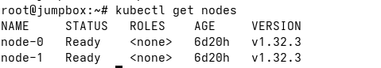
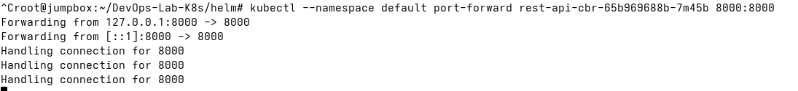
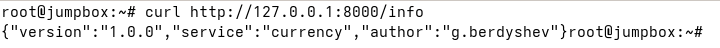
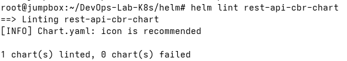
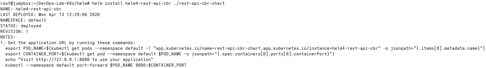
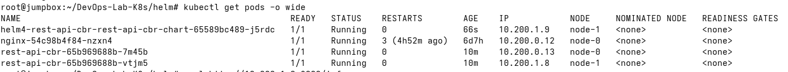
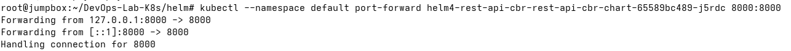
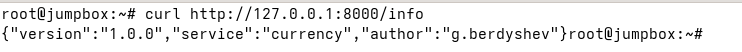
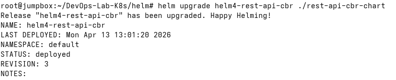
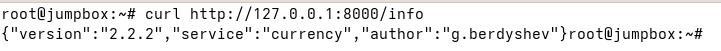

# DevOps-Lab-K8s

Развертывание кластера K8s я выполнил с помощью [K8s-The-Hard-Way](https://github.com/kelseyhightower/kubernetes-the-hard-way/tree/master) (jumpbox - VM для управления, 1 мастер-нода и 2 воркер-ноды).



Для деплоя было выбрано небольшое клиент-серверное приложение на Go, которое было написано мной в рамках другого курса. Docker образ расположен на [DockerHub](https://hub.docker.com/repository/docker/gberdyshev/rest-api-cbr).

## Манифесты

Далее были написаны манифесты для `deployment` и `service`, которые затем были объединены в единый `app.yaml`. 

Деплой выполнен с помощью команды `kubectl apply -f app.yaml`


Порт приложения был проброшен, после чего выполнен небольшой Smoke Test.





## Helm

Helm chart был создан с помощью команды `helm create rest-api-cbr-chart`.

Далее был запущен линтер:



Не с первого раза (были ошибки в labels), но был выполнен запуск через Helm:



Запущенные поды:



И аналогичный smoke test:






Теперь выполним обновление - я изменил версию образу на `latest`, а также переопределил переменную окружения `VERSION`.

Для этого в `values.yaml` была добавлена секция:

```
appConfig:
    version: "2.2.2"
```

А затем в `templates/deployment.yaml`:

```
containers:
    - name: ...

      env:
        - name: VERSION
          value: {{.Values.appConfig.version | quote}}
```

После этого выполняем обновление:


Аналогично пробрасываем порт и выполняем Smoke test:



Версия изменилась, а это значит, что изменения успешно применены и обновление выполнено.


Преимущества Helm:
- Версионирование релизов - Helm сохраняет историю релизов, поэтому мы можем выполнять откат к необходимой версии (rollback), если что-то сломалось.
- Интеграция с CI/CD - Helm чарты можно интегрировать в пайплайны (я с таким работал на стажировке - Gitlab CI + деплой с использованием Helm).
- Репозитории диаграмм + шаблонизация - в публичных репозиториях (ex. ArtifactHub) содержится множество готовых чартов для всевозможного софта + есть возможность реализовывать и переиспользовать локальные шаблоны в рамках компании.


## Результаты

В рамках данной лабораторной работы я осуществил развертывание в ручном режиме кластера K8s и понял, как взаимодействуют основные компоненты в K8s.

Также я выполнил развертывание клиент-серверного приложения с использованием манифестов и Helm, посмотрел, как может выполняться обновление приложения в кластере.